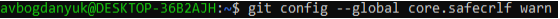

---
## Front matter
title: "ЛАБОРАТОРНАЯ РАБОТА № 2"
subtitle: "Архитектура компьютера"
author: "Богданюк Анна Васильевна"

## Generic otions
lang: ru-RU
toc-title: "Содержание"

## Bibliography
bibliography: bib/cite.bib
csl: pandoc/csl/gost-r-7-0-5-2008-numeric.csl

## Pdf output format
toc: true # Table of contents
toc-depth: 2
lof: true # List of figures
lot: true # List of tables
fontsize: 12pt
linestretch: 1.5
papersize: a4
documentclass: scrreprt
## I18n polyglossia
polyglossia-lang:
  name: russian
  options:
	- spelling=modern
	- babelshorthands=true
polyglossia-otherlangs:
  name: english
## I18n babel
babel-lang: russian
babel-otherlangs: english
## Fonts
mainfont: PT Serif
romanfont: PT Serif
sansfont: PT Sans
monofont: PT Mono
mainfontoptions: Ligatures=TeX
romanfontoptions: Ligatures=TeX
sansfontoptions: Ligatures=TeX,Scale=MatchLowercase
monofontoptions: Scale=MatchLowercase,Scale=0.9
## Biblatex
biblatex: true
biblio-style: "gost-numeric"
biblatexoptions:
  - parentracker=true
  - backend=biber
  - hyperref=auto
  - language=auto
  - autolang=other*
  - citestyle=gost-numeric
## Pandoc-crossref LaTeX customization
figureTitle: "Рис."
tableTitle: "Таблица"
listingTitle: "Листинг"
lofTitle: "Список иллюстраций"
lotTitle: "Список таблиц"
lolTitle: "Листинги"
## Misc options
indent: true
header-includes:
  - \usepackage{indentfirst}
  - \usepackage{float} # keep figures where there are in the text
  - \floatplacement{figure}{H} # keep figures where there are in the text
---

# Цель работы

Целью работы является изучить идеологию и применение средств контроля
версий. Приобрести практические навыки по работе с системой git

# Задание

1. Настройка github
2. Базовая настройка git
3. Создание SSH ключа
4. Сознание рабочего пространства и репозитория курса на основе шаблона
5. Сознание репозитория курса на основе шаблона
6. Настройка каталога курса
7. Задание для самостоятельной работы

# Теоретическое введение

Системы контроля версий (Version Control System, VCS) применяются
при работе нескольких человек над одним проектом. Обычно основное дерево
проекта хранится в локальном или удалённом репозитории, к которому настроен
доступ для участников проекта. При внесении изменений в содержание проекта
система контроля версий позволяет их фиксировать, совмещать изменения,
произведённые разными участниками проекта, производить откат к любой более
ранней версии проекта, если это требуется. В классических системах контроля
версий используется централизованная модель, предполагающая наличие единого
репозитория для хранения файлов. Выполнение большинства функций по
управлению версиями осуществляется специальным сервером. Участник проекта
(пользователь) перед началом работы посредством определённых команд получает
нужную ему версию файлов. После внесения изменений, пользователь размещает
новую версию в хранилище. При этом предыдущие версии не удаляются из
центрального хранилища и к ним можно вернуться в любой момент. Сервер может
сохранять не полную версию изменённых файлов, а производить так называемую
дельта-компрессию — сохранять только изменения между последовательными
версиями, что позволяет уменьшить объем хранимых данных. Системы контроля
версий поддерживают возможность отслеживания и разрешения конфликтов,
которые могут возникнуть при работе нескольких человек над одним файлом.
Можно объединить (слить) изменения, сделанные разными участниками
(автоматически или вручную), вручную выбрать нужную версию, отменить
изменения вовсе или заблокировать файлы для изменения. В зависимости от
настроек блокировка не позволяет другим пользователям получить рабочую копию
или препятствует изменению рабочей копии файла средствами файловой системы
ОС, обеспечивая таким образом, привилегированный доступ только одному
пользователю, работающему с файлом. Системы контроля версий также могут
обеспечивать дополнительные, более гибкие функциональные возможности.
Например, они могут поддерживать работу с несколькими версиями одного файла,
сохраняя общую историю изменений до точки ветвления версий и собственные
истории изменений каждой ветви. Кроме того, обычно доступна информация о том,
кто из участников, когда и какие изменения вносил. Обычно такого рода
информация хранится в журнале изменений, доступ к которому можно ограничить.
В отличие от классических, в распределённых системах контроля версий
центральный репозиторий не является обязательным. Среди классических VCS
наиболее известны CVS, Subversion, а среди распределённых — Git, Bazaar,
Mercurial. Принципы их работы схожи, отличаются они в основном синтаксисом
используемых в работе команд.

# Выполнение лабораторной работы

1. Настройка Github
Создала учетную запись на Github.(рис.1)

{
#fig:fig1 width=70% }

2. Базовая настройка git
Создаю предварительную конфигурацию git. Открыла терминал и
ввела следующие команды, указав имя пользователя и почту владельца
репозитории.(рис.2)

{
#fig:fig1 width=70% }

Настраиваю utf-8 в выводе сообщений git.(рис.3)

{
#fig:fig1 width=70% }

Задаю имя начальной ветки(master).(рис.4)

{
#fig:fig1 width=70% }

Параметр autocrlf.(рис.5)

{
#fig:fig1 width=70% }

Параметр safecrlf.(рис.6)

{
#fig:fig1 width=70% }

3. Создание SSH ключа
Генерирую приватный и открытый ключи.(рис.7)

{
#fig:fig1 width=70% }

Вывожу на экран ключ и копирую его.(рис.8)

{
#fig:fig1 width=70% }

Добавляю SSH Key.(рис.9)

{
#fig:fig1 width=70% }

4. Создание рабочего пространства и репозитория курса на основе шаблона
Создаю каталог для предмета Архитектура компьютера.(рис.10)

{
#fig:fig1 width=70% }

5. Создание репозитория курса на основе шаблона
Создаю репозиторий на основе шаблона.(рис.11)

{
#fig:fig1 width=70% }

Клонирую созданный репозиторий.(рис.12)

{
#fig:fig1 width=70% }

6. Настройка каталога курса
Перехожу в каталог и удаляю там лишние файлы.(рис.13)

{
#fig:fig1 width=70% }

Создаю необходимые каталоги.(рис.14)

{
#fig:fig1 width=70% }

Отправляю файлы на сервер.(рис.15 и 16)

{
#fig:fig1 width=70% }

{
#fig:fig1 width=70% }

Проверяю правильность создания иерархии рабочего пространства в
локальном репозитории и на странице github.(рис.17)

{
#fig:fig1 width=70% }

7. Задание для самостоятельной работы
Создаю файл отчета в labs/lab02/report и загружаю его на github.
(рис.18 и 19)

{
#fig:fig1 width=70% }

{
#fig:fig1 width=70% }

Копирую отчет по лабораторной работе 1 в labs/lab01/report и
загружаю его на github.(рис.20 и 21)

{
#fig:fig1 width=70% }

{
#fig:fig1 width=70% }

# Выводы

Во время выполнения Лабораторной работы 2 я изучила идеологию и применение средств контроля версий. Приобрела практические навыки по работе с системой git.

# Список литературы{.unnumbered}

::: {#refs}
:::
