---
## Front matter
title: "Отчет по лабораторной работе №4"
subtitle: "Создание и процесс обработки программ на языке ассемблера NASM"
author: "Богданюк Анна Васильевна"

## Generic otions
lang: ru-RU
toc-title: "Содержание"

## Bibliography
bibliography: bib/cite.bib
csl: pandoc/csl/gost-r-7-0-5-2008-numeric.csl

## Pdf output format
toc: true # Table of contents
toc-depth: 2
lof: true # List of figures
lot: true # List of tables
fontsize: 12pt
linestretch: 1.5
papersize: a4
documentclass: scrreprt
## I18n polyglossia
polyglossia-lang:
  name: russian
  options:
	- spelling=modern
	- babelshorthands=true
polyglossia-otherlangs:
  name: english
## I18n babel
babel-lang: russian
babel-otherlangs: english
## Fonts
mainfont: PT Serif
romanfont: PT Serif
sansfont: PT Sans
monofont: PT Mono
mainfontoptions: Ligatures=TeX
romanfontoptions: Ligatures=TeX
sansfontoptions: Ligatures=TeX,Scale=MatchLowercase
monofontoptions: Scale=MatchLowercase,Scale=0.9
## Biblatex
biblatex: true
biblio-style: "gost-numeric"
biblatexoptions:
  - parentracker=true
  - backend=biber
  - hyperref=auto
  - language=auto
  - autolang=other*
  - citestyle=gost-numeric
## Pandoc-crossref LaTeX customization
figureTitle: "Рис."
tableTitle: "Таблица"
listingTitle: "Листинг"
lofTitle: "Список иллюстраций"
lotTitle: "Список таблиц"
lolTitle: "Листинги"
## Misc options
indent: true
header-includes:
  - \usepackage{indentfirst}
  - \usepackage{float} # keep figures where there are in the text
  - \floatplacement{figure}{H} # keep figures where there are in the text
---

# Цель работы

Освоение процедуры компиляции и сборки программ, написанных на ассемблере NASM.

# Задание

1.Выполнение лабораторной работы

2.Задания для самостоятельной работы

# Теоретическое введение

Язык ассемблера (assembly language, сокращённо asm) — машинно-ориентированный
язык низкого уровня. Можно считать, что он больше любых других языков приближен к
архитектуре ЭВМ и её аппаратным возможностям, что позволяет получить к ним более
полный доступ, нежели в языках высокого уровня,таких как C/C++, Perl, Python и пр. Заметим,
что получить полный доступ к ресурсам компьютера в современных архитектурах нельзя,
самым низким уровнем работы прикладной программы является обращение напрямую к
ядру операционной системы. Именно на этом уровне и работают программы, написанные
на ассемблере. Но в отличие от языков высокого уровня ассемблерная программа содержит
только тот код, который ввёл программист. Таким образом язык ассемблера — это язык, с
помощью которого понятным для человека образом пишутся команды для процессора.
Следует отметить, что процессор понимает не команды ассемблера, а последовательности
из нулей и единиц — машинные коды. До появления языков ассемблера программистам
приходилось писать программы, используя только лишь машинные коды, которые были
крайне сложны для запоминания, так как представляли собой числа, записанные в двоичной
или шестнадцатеричной системе счисления. Преобразование или трансляция команд с
языка ассемблера в исполняемый машинный код осуществляется специальной программой
транслятором — Ассемблер.
Программы, написанные на языке ассемблера, не уступают в качестве и скорости программам, написанным на машинном языке,так как транслятор просто переводит мнемонические
обозначения команд в последовательности бит (нулей и единиц).
Используемые мнемоники обычно одинаковы для всех процессоров одной архитектуры
или семейства архитектур (среди широко известных — мнемоники процессоров и контроллеров x86, ARM, SPARC, PowerPC,M68k). Таким образом для каждой архитектуры существует
свой ассемблер и, соответственно, свой язык ассемблера.
Наиболее распространёнными ассемблерами для архитектуры x86 являются:
• для DOS/Windows: Borland Turbo Assembler (TASM), Microsoft Macro Assembler (MASM) и
Watcom assembler (WASM);
• для GNU/Linux: gas (GNU Assembler), использующий AT&T-синтаксис, в отличие от
большинства других популярных ассемблеров, которые используют Intel-синтаксис.

В процессе создания ассемблерной программы можно выделить четыре шага:
• Набор текста программы в текстовом редакторе и сохранение её в отдельном файле.
Каждый файл имеет свой тип (или расширение), который определяет назначение файла.
Файлы с исходным текстом программ на языке ассемблера имеют тип asm.
• Трансляция — преобразование с помощью транслятора, например nasm, текста программы в машинный код, называемый объектным. На данном этапе также может быть
получен листинг программы, содержащий кроме текста программы различную дополнительную информацию, созданную транслятором. Тип объектного файла — o, файла
листинга — lst.
• Компоновка или линковка — этап обработки объектного кода компоновщиком (ld),
который принимает на вход объектные файлы и собирает по ним исполняемый файл.
Исполняемый файл обычно не имеет расширения. Кроме того, можно получить файл
карты загрузки программы в ОЗУ, имеющий расширение map.
• Запуск программы. Конечной целью является работоспособный исполняемый файл.
Ошибки на предыдущих этапах могут привести к некорректной работе программы,
поэтому может присутствовать этап отладки программы при помощи специальной
программы — отладчика. При нахождении ошибки необходимо провести коррекцию
программы, начиная с первого шага.

# Выполнение лабораторной работы
1.1. Программа Hello world!

Создаю каталог для работы с программами на языке ассеблера NASM (рис. @fig:001).

{#fig:001 width=70%}

Перехожу в созданный каталог (рис. @fig:002).

{#fig:002 width=70%}

Создаю текстовый файл с именем hello.asm (рис. @fig:003).

{#fig:003 width=70%}

Открываю этот файл с помощью nano (рис. @fig:004).

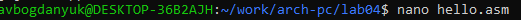{#fig:004 width=70%}

Ввожу следующий текст (рис. @fig:005).

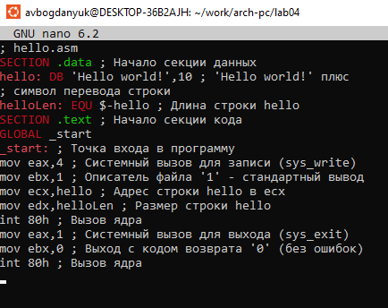{#fig:005 width=70%}

1.2. Транслятор NASM

Компилирую текст в объектный код (рис. @fig:006).

{#fig:006 width=70%}

Проверяю с помощью ls, что был создан объектный файл (рис. @fig:007).

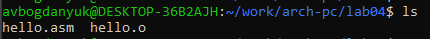{#fig:007 width=70%}

1.3. Расширенный синтаксис командной строки NASM

Компилирую файл hello.asm в obj.o, а также создаю файл листинга list.lst (рис. @fig:008).

{#fig:008 width=70%}

Проверяю, что файлы были созданы (рис. @fig:009).

{#fig:009 width=70%}

1.4. Компоновщик LD

Передаю объектный файл на обработку компоновщику(рис. @fig:010).

{#fig:010 width=70%}

Проверяю, что файл был создан (рис. @fig:011).

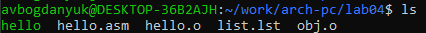{#fig:011 width=70%}

Выполняю следующую команду. Созданый файл будет называться main, объектный файл, из которого собран этот исполняемый файл, называется obj.o (рис. @fig:012).

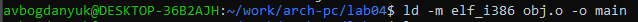{#fig:012 width=70%}

1.5. Запуск исполняемого файла

Запускаю на выполнение созданный исполняемый файл (рис. @fig:013).

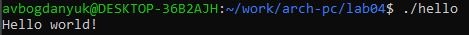{#fig:013 width=70%}

2. Задание для самостоятельной работы

Копирую файл hello.asm с именем lab4.asm (рис. @fig:014).

{#fig:014 width=70%}

Изменяю текст, чтобы вместо 'Hello World!', было 'Богданюк Анна' (рис. @fig:015).

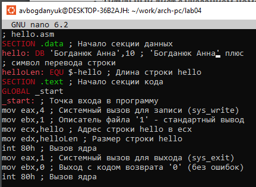{#fig:015 width=70%}

Оттрансилую полученный файл в объектный файл и проверяю, что файл был создан (рис. @fig:016).

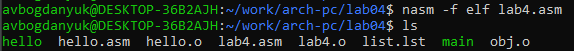{#fig:016 width=70%}

Выполняю компоновку объектного файла и проверяю, что файл был создан(рис. @fig:017).

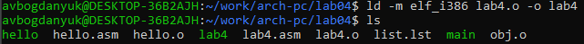{#fig:017 width=70%}

Запускаю получившийся исполняемый файл (рис. @fig:018).

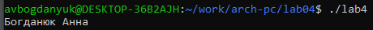{#fig:018 width=70%}

Копирую файл hello.asm и lab4.asm  в мой локальный репозиторий в каталог ~/work/study/2023-2024/"Архитектура компьютера"/arch-pc/labs/lab04/ (рис. @fig:019).

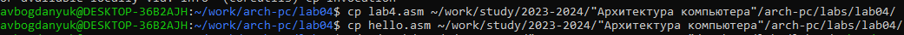{#fig:019 width=70%}

Загружаю файлы на GitHub (рис. @fig:020).

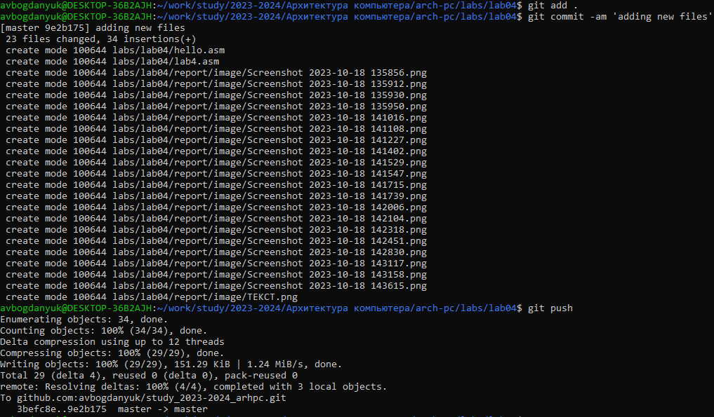{#fig:020 width=70%}

# Выводы

Освоила процедуры компиляции и сборки программ, написанных на ассемблере NASM.

# Список литературы{.unnumbered}

::: {#refs}
:::
