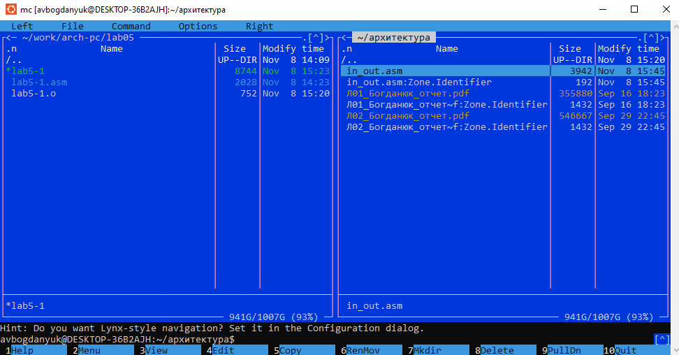
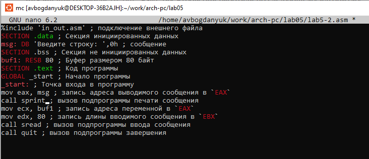
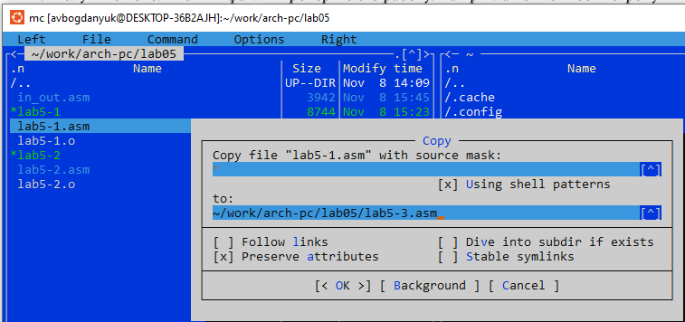
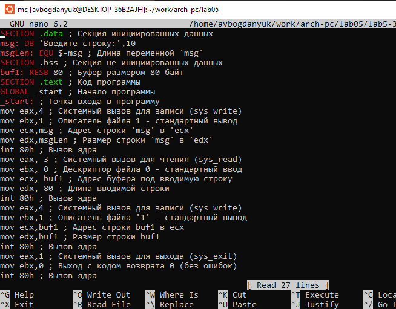

---
## Front matter
title: "Лабораторная работа №5"
subtitle: "Основы работы с Midnight Commander (mc). Структура программы на языке ассемблера NASM. Системные вызовы в ОС GNU Linux"
author: "Богданюк Анна Васильевна"

## Generic otions
lang: ru-RU
toc-title: "Содержание"

## Bibliography
bibliography: bib/cite.bib
csl: pandoc/csl/gost-r-7-0-5-2008-numeric.csl

## Pdf output format
toc: true # Table of contents
toc-depth: 2
lof: true # List of figures
lot: true # List of tables
fontsize: 12pt
linestretch: 1.5
papersize: a4
documentclass: scrreprt
## I18n polyglossia
polyglossia-lang:
  name: russian
  options:
	- spelling=modern
	- babelshorthands=true
polyglossia-otherlangs:
  name: english
## I18n babel
babel-lang: russian
babel-otherlangs: english
## Fonts
mainfont: PT Serif
romanfont: PT Serif
sansfont: PT Sans
monofont: PT Mono
mainfontoptions: Ligatures=TeX
romanfontoptions: Ligatures=TeX
sansfontoptions: Ligatures=TeX,Scale=MatchLowercase
monofontoptions: Scale=MatchLowercase,Scale=0.9
## Biblatex
biblatex: true
biblio-style: "gost-numeric"
biblatexoptions:
  - parentracker=true
  - backend=biber
  - hyperref=auto
  - language=auto
  - autolang=other*
  - citestyle=gost-numeric
## Pandoc-crossref LaTeX customization
figureTitle: "Рис."
tableTitle: "Таблица"
listingTitle: "Листинг"
lofTitle: "Список иллюстраций"
lotTitle: "Список таблиц"
lolTitle: "Листинги"
## Misc options
indent: true
header-includes:
  - \usepackage{indentfirst}
  - \usepackage{float} # keep figures where there are in the text
  - \floatplacement{figure}{H} # keep figures where there are in the text
---

# Цель работы

Приобретение практических навыков работы в Midnight Commander. Освоение инструкций
языка ассемблера mov и int.

# Задание

1. Выполнение лабораторной работы
2. Задания для самостоятельной работы

# Теоретическое введение

Midnight Commander (или просто mc) — это программа, которая позволяет просматривать
структуру каталогов и выполнять основные операции по управлению файловой системой,
т.е. mc является файловым менеджером. Midnight Commander позволяет сделать работу с
файлами более удобной и наглядной.

Программа на языке ассемблера NASM, как правило, состоит из трёх секций: секция кода
программы (SECTION .text), секция инициированных (известных во время компиляции)
данных (SECTION .data) и секция неинициализированных данных (тех, под которые во
время компиляции только отводится память, а значение присваивается в ходе выполнения
программы) (SECTION .bss).

Простейший диалог с пользователем требует наличия двух функций — вывода текста на
экран и ввода текста с клавиатуры. Простейший способ вывести строку на экран — использовать системный вызов write. Этот системный вызов имеет номер 4, поэтому перед вызовом
инструкции int необходимо поместить значение 4 в регистр eax. Первым аргументом write,
помещаемым в регистр ebx, задаётся дескриптор файла. Для вывода на экран в качестве
дескриптора файла нужно указать 1 (это означает «стандартный вывод», т. е. вывод на экран).
Вторым аргументом задаётся адрес выводимой строки (помещаем его в регистр ecx, например, инструкцией mov ecx, msg). Строка может иметь любую длину. Последним аргументом
(т.е. в регистре edx) должна задаваться максимальная длина выводимой строки.
Для ввода строки с клавиатуры можно использовать аналогичный системный вызов read.
Его аргументы –такие же, как у вызова write,только для «чтения» с клавиатуры используется
файловый дескриптор 0 (стандартный ввод).
Системный вызов exit является обязательным в конце любой программы на языке ассемблер. Для обозначения конца программы перед вызовом инструкции int 80h необходимо
поместить в регистр еах значение 1, а в регистр ebx код завершения 0.

# Выполнение лабораторной работы

1. Выполнение лабораторной работы

Окрываю Midnight Commander с помощью mc (рис. @fig:001).

{#fig:001 width=70%}

Midnight Commander (рис. @fig:002).

{#fig:002 width=70%}

Перехожу в каталог, созданный в ходе лабораторной работы №4 (рис. @fig:003).

{#fig:003 width=70%}

Создаю новый каталог lab05 (рис. @fig:004).

{#fig:004 width=70%}

Перехожу в новый каталог(рис. @fig:005).

{#fig:005 width=70%}

С помощью touch создаю новый файл lab5-1.asm (рис. @fig:006).

{#fig:006 width=70%}

Редактирую созданный файл (рис. @fig:007).

{#fig:007 width=70%}

Ввожу текст из листинга, сохраняю файл и закрываю его (рис. @fig:008).

{#fig:008 width=70%}

Листинг программы:

```NASM
SECTION .data ; Секция инициированных данных
msg: DB 'Введите строку:',10 ; сообщение плюс
; символ перевода строки
msgLen: EQU $-msg ; Длина переменной 'msg'
SECTION .bss ; Секция не инициированных данных
buf1: RESB 80 ; Буфер размером 80 байт
SECTION .text ; Код программы
GLOBAL _start ; Начало программы
_start: ; Точка входа в программу
;------------ Cистемный вызов `write`
; После вызова инструкции 'int 80h' на экран будет
; выведено сообщение из переменной 'msg' длиной 'msgLen'
mov eax,4 ; Системный вызов для записи (sys_write)
mov ebx,1 ; Описатель файла 1 - стандартный вывод
mov ecx,msg ; Адрес строки 'msg' в 'ecx'
mov edx,msgLen ; Размер строки 'msg' в 'edx'
int 80h ; Вызов ядра
;------------ системный вызов `read` ----------------------
; После вызова инструкции 'int 80h' программа будет ожидать ввода
; строки, которая будет записана в переменную 'buf1' размером 80 байт
mov eax, 3 ; Системный вызов для чтения (sys_read)
mov ebx, 0 ; Дескриптор файла 0 - стандартный ввод
mov ecx, buf1 ; Адрес буфера под вводимую строку
mov edx, 80 ; Длина вводимой строки
int 80h ; Вызов ядра
;------------ Системный вызов `exit` ----------------------
; После вызова инструкции 'int 80h' программа завершит работу
mov eax,1 ; Системный вызов для выхода (sys_exit)
mov ebx,0 ; Выход с кодом возврата 0 (без ошибок)
int 80h ; Вызов ядра"
```

С помощью функциональной клавиши F3 открываю файл для просмотра. Убеждаюсь, что файл содержит текст программы (рис. @fig:009).

{#fig:009 width=70%}

Оттранслирую текст программы lab5-1.asm в объектный файл (рис. @fig:010).

{#fig:010 width=70%}

Выполняю компановку объектного файла (рис. @fig:011).

{#fig:011 width=70%}

Запускаю получившийся файл и ввожу своё ФИО (рис. @fig:012).

{#fig:012 width=70%}

Скачиваю файл in_out.asm (рис. @fig:013).

{#fig:013 width=70%}

Так как файл in_out.asm должен находиться в одном каталоге с файлом с программой, в которой он используется. Открываю в одной панели mc каталог с файлом lab5-1.asm. В другой панели каталог со скаченным файлом in_out.asm. (рис. @fig:014).

{#fig:014 width=70%}

Копирую файл in_out.asm в каталог с файлом lab5-1.asm (рис. @fig:015).

{#fig:015 width=70%}

Копирую файл lab5-1.asm с именем lab5-2.asm (рис. @fig:016).

{#fig:016 width=70%}

Исправляю текст программы lab5-2.asm, где меняю sprintLF на sprint (рис. @fig:017).

{#fig:017 width=70%}

Листинг программы:

```NASM
"%include 'in_out.asm' ; подключение внешнего файла
SECTION .data ; Секция инициированных данных
msg: DB 'Введите строку: ',0h ; сообщение
SECTION .bss ; Секция не инициированных данных
buf1: RESB 80 ; Буфер размером 80 байт
SECTION .text ; Код программы
GLOBAL _start ; Начало программы
_start: ; Точка входа в программу
mov eax, msg ; запись адреса выводимого сообщения в `EAX`
call sprint ; вызов подпрограммы печати сообщения
mov ecx, buf1 ; запись адреса переменной в `EAX`
mov edx, 80 ; запись длины вводимого сообщения в `EBX`
call sread ; вызов подпрограммы ввода сообщения
call quit ; вызов подпрограммы завершения"
```

Создаю исполнительный файл для lab5-2.asm и проверью его работу. Разница: sprintLF – работает аналогично sprint, но при выводе на экран добавляет к сообщению символ перевода строки (рис. @fig:018).

{#fig:018 width=70%}

2. Задания для самостоятельной работы

Создаю копию файла lab5-1.asm с названием lab5-3.asm (рис. @fig:019).

{#fig:019 width=70%}

Изменяю файл, чтобы был ввывод строки, ввод пользователем и вывод строки (рис. @fig:020).

{#fig:020 width=70%}

Листинг программы:

```NASM
"SECTION .data ; Секция инициированных данных
msg: DB 'Введите строку:',10
msgLen: EQU $-msg ; Длина переменной 'msg'
SECTION .bss ; Секция не инициированных данных
buf1: RESB 80 ; Буфер размером 80 байт
SECTION .text ; Код программы
GLOBAL _start ; Начало программы
_start: ; Точка входа в программу
mov eax,4 ; Системный вызов для записи (sys_write)
mov ebx,1 ; Описатель файла 1 - стандартный вывод
mov ecx,msg ; Адрес строки 'msg' в 'ecx'
mov edx,msgLen ; Размер строки 'msg' в 'edx'
int 80h ; Вызов ядра
mov eax, 3 ; Системный вызов для чтения (sys_read)
mov ebx, 0 ; Дескриптор файла 0 - стандартный ввод
mov ecx, buf1 ; Адрес буфера под вводимую строку
mov edx, 80 ; Длина вводимой строки
int 80h ; Вызов ядра
mov eax,4 ; Системный вызов для записи (sys_write)
mov ebx,1 ; Описатель файла '1' - стандартный вывод
mov ecx,buf1 ; Адрес строки buf1 в ecx
mov edx,buf1 ; Размер строки buf1
int 80h ; Вызов ядра
mov eax,1 ; Системный вызов для выхода (sys_exit)
mov ebx,0 ; Выход с кодом возврата 0 (без ошибок)
int 80h ; Вызов ядра"
```

Запускаю исполнительный файл (рис. @fig:021).

{#fig:021 width=70%}

Копирую файл lab5-2.asm с именем lab5-4.asm (рис. @fig:022).

{#fig:022 width=70%}

Изменяю файл, чтобы был ввывод строки, ввод пользователем и вывод строки (рис. @fig:023).

{#fig:023 width=70%}

Листинг программы:

```NASM
"%include 'in_out.asm' ; подключение внешнего файла
SECTION .data ; Секция инициированных данных
msg: DB 'Введите строку: ',0h ; сообщение
SECTION .bss ; Секция не инициированных данных
buf1: RESB 80 ; Буфер размером 80 байт
SECTION .text ; Код программы
GLOBAL _start ; Начало программы
_start: ; Точка входа в программу
mov eax, msg ; запись адреса выводимого сообщения в `EAX`
call sprint ; вызов подпрограммы печати сообщения
mov ecx, buf1 ; запись адреса переменной в `EAX`
mov edx, 80 ; запись длины вводимого сообщения в `EBX`
call sread ; вызов подпрограммы ввода сообщения
mov eax,4 ; Системный вызов для записи (sys_write)
mov ebx,1 ; Описатель файла '1' - стандартный вывод
mov ecx,buf1 ; Адрес строки buf1 в ecx
int 80h ; Вызов ядра
call quit ; вызов подпрограммы завершения"
```

Запускаю исполнительный файл (рис. @fig:024).

{#fig:024 width=70%}

# Выводы

Во время выполнения лабораторной работы приобрела практические навыки работы в Midnight Commander. Основание инструкций языка ассемблера mov и int.

# Список литературы{.unnumbered}

::: {#refs}
:::
