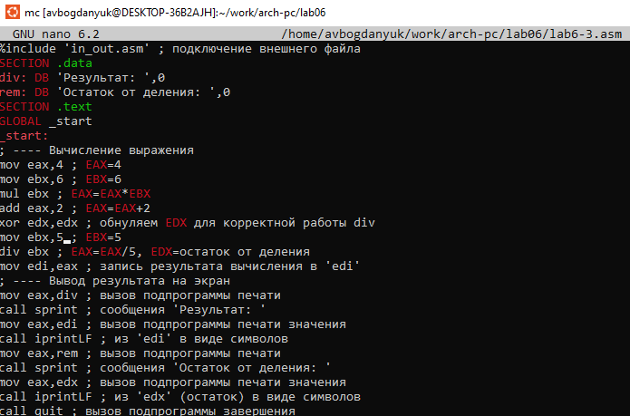

---
## Front matter
title: "Лабораторная работа №6"
subtitle: "Арифметическиеоперации в NASM"
author: "Богданюк Анна Васильевна"

## Generic otions
lang: ru-RU
toc-title: "Содержание"

## Bibliography
bibliography: bib/cite.bib
csl: pandoc/csl/gost-r-7-0-5-2008-numeric.csl

## Pdf output format
toc: true # Table of contents
toc-depth: 2
lof: true # List of figures
lot: true # List of tables
fontsize: 12pt
linestretch: 1.5
papersize: a4
documentclass: scrreprt
## I18n polyglossia
polyglossia-lang:
  name: russian
  options:
	- spelling=modern
	- babelshorthands=true
polyglossia-otherlangs:
  name: english
## I18n babel
babel-lang: russian
babel-otherlangs: english
## Fonts
mainfont: PT Serif
romanfont: PT Serif
sansfont: PT Sans
monofont: PT Mono
mainfontoptions: Ligatures=TeX
romanfontoptions: Ligatures=TeX
sansfontoptions: Ligatures=TeX,Scale=MatchLowercase
monofontoptions: Scale=MatchLowercase,Scale=0.9
## Biblatex
biblatex: true
biblio-style: "gost-numeric"
biblatexoptions:
  - parentracker=true
  - backend=biber
  - hyperref=auto
  - language=auto
  - autolang=other*
  - citestyle=gost-numeric
## Pandoc-crossref LaTeX customization
figureTitle: "Рис."
tableTitle: "Таблица"
listingTitle: "Листинг"
lofTitle: "Список иллюстраций"
lotTitle: "Список таблиц"
lolTitle: "Листинги"
## Misc options
indent: true
header-includes:
  - \usepackage{indentfirst}
  - \usepackage{float} # keep figures where there are in the text
  - \floatplacement{figure}{H} # keep figures where there are in the text
---

# Цель работы

Освоение арифметических инструкций языка ассемблера NASM.

# Задание

1. Выполнение лабораторной работы
2. Задние для самостоятельной работы

# Теоретическое введение

Существует три основных способа адресации:
• Регистровая адресация – операнды хранятся в регистрах и в команде используются
имена этих регистров, например: mov ax,bx.
• Непосредственная адресация – значение операнда задается непосредственно в команде, Например: mov ax,2.
• Адресация памяти – операнд задает адрес в памяти. В команде указывается символическое обозначение ячейки памяти, над содержимым которой требуется выполнить
операцию.

Схема команды целочисленного сложения add (от англ. addition - добавление) выполняет
сложение двух операндов и записывает результат по адресу первого операнда. Команда add
работает как с числами со знаком, так и без знака.

Довольно часто при написании программ встречается операция прибавления или вычитания единицы. Прибавление единицы называется инкрементом, а вычитание — декрементом.
Для этих операций существуют специальные команды: inc (от англ. increment) и dec (от англ.
decrement), которые увеличивают и уменьшают на 1 свой операнд.

Команда neg рассматривает свой операнд как число со знаком и меняет знак операнда на
противоположный. Операндом может быть регистр или ячейка памяти любого размера.

Для деления, как и для умножения, существует 2 команды div (от англ. divide - деление) и
idiv.

Ввод информации с клавиатуры и вывод её на экран осуществляется в символьном виде.
Кодирование этой информации производится согласно кодовой таблице символов ASCII.
ASCII – сокращение от American Standard Code for Information Interchange (Американский
стандартный код для обмена информацией). Согласно стандарту ASCII каждый символ
кодируется одним байтом.
Расширенная таблица ASCII состоит из двух частей. Первая (символы с кодами 0-127)
является универсальной (см. Приложение.), а вторая (коды 128-255) предназначена для
специальных символов и букв национальных алфавитов и на компьютерах разных типов
может меняться.
Среди инструкций NASM нет такой, которая выводит числа (не в символьном виде). Поэтому, например, чтобы вывести число, надо предварительно преобразовать его цифры в
ASCII-коды этих цифр и выводить на экран эти коды, а не само число. Если же выводить число
на экран непосредственно, то экран воспримет его не как число, а как последовательность
ASCII-символов – каждый байт числа будет воспринят как один ASCII-символ – и выведет на
экран эти символы.
Аналогичная ситуация происходит и при вводе данных с клавиатуры. Введенные данные будут представлять собой символы, что сделает невозможным получение корректного
результата при выполнении над ними арифметических операций.
Для решения этой проблемы необходимо проводить преобразование ASCII символов в
числа и обратно.
Для выполнения лабораторных работ в файле in_out.asm реализованы подпрограммы
для преобразования ASCII символов в числа и обратно.

# Выполнение лабораторной работы

1. Выполнение лабораторной работы

Создаю каталог для программ лабораторной работы №6, перехожу в него и создаю файл lab6-1.asm (рис. @fig:001).

{#fig:001 width=70%}

Ввожу текст программы из листинга.В данной программе в регистр eax записывается символ 6 (mov eax,'6'), в регистр ebx символ 4 (mov ebx,'4').
Далее к значению в регистре eax прибавляем значение регистра ebx (add eax,ebx, результат сложения запишется в регистр eax). Далее выводим результат. Так как для работы
функции sprintLF в регистр eax должен быть записан адрес, необходимо использовать дополнительную переменную. Для этого запишем значение регистра eax в переменную buf1
(mov [buf1],eax), а затем запишем адрес переменной buf1 в регистр eax (mov eax,buf1) и
вызовем функцию sprintLF. (рис. @fig:002).

{#fig:002 width=70%}

Листинг:
```NASM
%include 'in_out.asm'
SECTION .bss
buf1: RESB 80
SECTION .text
GLOBAL _start
_start:
mov eax,'6'
mov ebx,'4'
add eax,ebx
mov [buf1],eax
mov eax,buf1
call sprintLF
call quit
```

Копирую файл in_out.asm в тот же каталог, где находится lab6-1.asm (рис. @fig:003).

{#fig:003 width=70%}

Создаю исполняемый файл и запускаю его. В данном случае при выводе значения регистра eax мы ожидаем увидеть число 10. Однако
результатом будет символ j. Это происходит потому, что код символа 6 равен 00110110 в
двоичном представлении (или 54 в десятичном представлении), а код символа 4 – 00110100 (52). Команда add eax,ebx запишет в регистр eax сумму кодов – 01101010 (106), что в свою
очередь является кодом символа j (рис. @fig:004).

{#fig:004 width=70%}

Изменяю текст программы и вместо символов, пишу в регистры числа (рис. @fig:005).

{#fig:005 width=70%}

Создаю исполняемый файл и запускаю его. Как и в предыдущем случае при исполнении программы мы не получим число 10. В данном
случае выводится символ с кодом 10. Это символ перевода строки, символ не отображается на экране (рис. @fig:006).

{#fig:006 width=70%}

Создаю файл lab6-2.asm и ввожу в него текст программы листинга (рис. @fig:007).

{#fig:007 width=70%}

Листинг:
```NASM
%include 'in_out.asm'
SECTION .text
GLOBAL _start
_start:
mov eax,'6'
mov ebx,'4'
add eax,ebx
call iprintLF
call quit
```

Создаю исполнительный файл и запускаю его. В результате работы программы мы получим число 106. В данном случае, как и в первом,
команда add складывает коды символов ‘6’ и ‘4’ (54+52=106). Однако, в отличии от программы
из листинга 6.1, функция iprintLF позволяет вывести число, а не символ, кодом которого
является это число (рис. @fig:008).

{#fig:008 width=70%}

Измению символы на числа (рис. @fig:009).

{#fig:009 width=70%}

Создаю исполнительный файл и запускаю его. При исполнении программы выводится число 10, так как складываются числа 6 и 4 (рис. @fig:010).

{#fig:010 width=70%}

Заменяю функцию iprintLF на iprint. (рис. @fig:011).

{#fig:011 width=70%}

Создаю исполнительный файл и запускаю его. iprint не добавляет символ переноса строки (рис. @fig:012).

{#fig:012 width=70%}

Создаю файл lab6-3.asm и ввожу в него текст программы листинга(рис. @fig:013).

{#fig:013 width=70%}

```NASM
%include 'in_out.asm' ; подключение внешнего файла
SECTION .data
div: DB 'Результат: ',0
rem: DB 'Остаток от деления: ',0
SECTION .text
GLOBAL _start
_start:
; ---- Вычисление выражения
mov eax,5 ; EAX=5
mov ebx,2 ; EBX=2
mul ebx ; EAX=EAX*EBX
add eax,3 ; EAX=EAX+3
xor edx,edx ; обнуляем EDX для корректной работы div
mov ebx,3 ; EBX=3
div ebx ; EAX=EAX/3, EDX=остаток от деления
mov edi,eax ; запись результата вычисления в 'edi'
; ---- Вывод результата на экран
mov eax,div ; вызов подпрограммы печати
call sprint ; сообщения 'Результат: '
mov eax,edi ; вызов подпрограммы печати значения
call iprintLF ; из 'edi' в виде символов
mov eax,rem ; вызов подпрограммы печати
call sprint ; сообщения 'Остаток от деления: '
mov eax,edx ; вызов подпрограммы печати значения
call iprintLF ; из 'edx' (остаток) в виде символов
call quit ; вызов подпрограммы завершения
```

Создаю исполнительный файл и запускаю его (рис. @fig:014).

{#fig:014 width=70%}

Изменяю текст программы для вычисления выражения f(x) = (4 * 6 + 2)/5. (рис. @fig:015).

{#fig:015 width=70%}

Создаю исполнительный файл и запускаю его (рис. @fig:016).

{#fig:016 width=70%}

Создаю файл variant.asm и ввожу в него текст программы из листинга (рис. @fig:017).

{#fig:017 width=70%}

Листинг:
```NASM
%include 'in_out.asm'
SECTION .data
msg: DB 'Введите № студенческого билета: ',0
rem: DB 'Ваш вариант: ',0
SECTION .bss
x: RESB 80
SECTION .text
GLOBAL _start
_start:
mov eax, msg
call sprintLF
mov ecx, x
mov edx, 80
call sread
mov eax,x ; вызов подпрограммы преобразования
call atoi ; ASCII кода в число, `eax=x`
xor edx,edx
mov ebx,20
div ebx
inc edx
mov eax,rem
call sprint
mov eax,edx
call iprintLF
call quit
```

Создаю исполнительный файл и запускаю его. Программа определила номер варианта 4 (рис. @fig:018).

{#fig:018 width=70%}

1)За вывод сообщения "Ваш вариант" отвечают строки:
'''NASM
mov eax,rem
call sprint
'''

2)mov ecx,x используется, чтобы положить адрес вводимой строки x в ecx. mov edx,80 используется для записи в edx длины вводимой строки. call sread для вызова подпрограммы из внешного файла для ввода текста с клавиатуры.

3)call atoi используется для вызова подпрограммы из внешного файла, что преобразает ascii-код символа в целое число и записывает результат в eax.

4)
```NASM
xor edx,edx
mov ebx,20
div ebx
inc edx
```

5)Остаток от деления при выполнении иструкции div ebx записывается в edx.

6)inc edx используется для увеличения значения edx на 1.

7)
```NASM
mov eax,edx
call iprintLF
```

2.Задания для самостоятельной работы

Создаю файл lab6-4.asm и ввожу в файл текст программы для счета выражения (4/3)*(x-1)+5(рис. @fig:019).

{#fig:019 width=70%}

Листинг:
```NASM
%include 'in_out.asm'
SECTION .data
msg: DB 'Введите значение переменной x: ',0
answer: DB 'Результат ',0

SECTION .bss
x: RESB 80
result: RESB 80

SECTION .text
GLOBAL _start

_start:
mov eax, msg
call sprint

mov ecx, x
mov edx, 80
call sread

mov eax,x
call atoi

add eax,-1
mov ebx,4
mul ebx
mov ebx,3
div ebx
add eax,5
mov [result],eax

mov eax,answer ; вызов подпрограммы печати
call sprint ; сообщения 'Результат: '

mov eax,[result]
call iprintLF

call quit
```

Создаю исполнительный файл и запускаю его. Проверяю, ответы верные (рис. @fig:020).

{#fig:020 width=70%}

# Выводы

В ходе выполнения лабораторной работы я своила арифметические инструкции языка ассемблера NASM.

# Список литературы{.unnumbered}

::: {#refs}
:::
