---
## Front matter
title: "Лабораторная работа №7"
subtitle: "Команды безусловного и условного переходов в Nasm. Программирование ветвлений."
author: "Богданюк Анна Васильевна"

## Generic otions
lang: ru-RU
toc-title: "Содержание"

## Bibliography
bibliography: bib/cite.bib
csl: pandoc/csl/gost-r-7-0-5-2008-numeric.csl

## Pdf output format
toc: true # Table of contents
toc-depth: 2
lof: true # List of figures
lot: true # List of tables
fontsize: 12pt
linestretch: 1.5
papersize: a4
documentclass: scrreprt
## I18n polyglossia
polyglossia-lang:
  name: russian
  options:
	- spelling=modern
	- babelshorthands=true
polyglossia-otherlangs:
  name: english
## I18n babel
babel-lang: russian
babel-otherlangs: english
## Fonts
mainfont: PT Serif
romanfont: PT Serif
sansfont: PT Sans
monofont: PT Mono
mainfontoptions: Ligatures=TeX
romanfontoptions: Ligatures=TeX
sansfontoptions: Ligatures=TeX,Scale=MatchLowercase
monofontoptions: Scale=MatchLowercase,Scale=0.9
## Biblatex
biblatex: true
biblio-style: "gost-numeric"
biblatexoptions:
  - parentracker=true
  - backend=biber
  - hyperref=auto
  - language=auto
  - autolang=other*
  - citestyle=gost-numeric
## Pandoc-crossref LaTeX customization
figureTitle: "Рис."
tableTitle: "Таблица"
listingTitle: "Листинг"
lofTitle: "Список иллюстраций"
lotTitle: "Список таблиц"
lolTitle: "Листинги"
## Misc options
indent: true
header-includes:
  - \usepackage{indentfirst}
  - \usepackage{float} # keep figures where there are in the text
  - \floatplacement{figure}{H} # keep figures where there are in the text
---

# Цель работы

Изучение команд условного и безусловного переходов. Приобретение навыков написания
программ с использованием переходов. Знакомство с назначением и структурой файла
листинга.

# Задание

1. Выполнение лабораторной работы
2. Задания для самостоятельной работы

# Теоретическое введение

Для реализации ветвлений в ассемблере используются так называемые команды передачи
управления или команды перехода. Можно выделить 2 типа переходов:
• условный переход – выполнение или не выполнение перехода в определенную точку
программы в зависимости от проверки условия.
• безусловный переход – выполнение передачи управления в определенную точку программы без каких-либо условий.
Безусловный переход выполняется инструкцией jmp (от англ. jump – прыжок), которая
включает в себя адрес перехода, куда следует передать управление.
Адрес перехода может быть либо меткой, либо адресом области памяти, в которую предварительно помещен указатель перехода. Кроме того, в качестве операнда можно использовать
имя регистра, в таком случае переход будет осуществляться по адресу, хранящемуся в этом
регистре.
Флаг – это бит, принимающий значение 1 («флаг установлен»), если выполнено некоторое
условие, и значение 0 («флаг сброшен») в противном случае. Флаги работают независимо
друг от друга, и лишь для удобства они помещены в единый регистр — регистр флагов, отражающий текущее состояние процессора. В следующей таблице указано положение битовых
флагов в регистре флагов.
Инструкция cmp является одной из инструкций, которая позволяет сравнить операнды и
выставляет флаги в зависимости от результата сравнения.
Инструкция cmp является командой сравнения двух операндов и имеет такой же формат,
как и команда вычитания.
Листинг (в рамках понятийного аппарата NASM) — это один из выходных файлов, создаваемых транслятором. Он имеет текстовый вид и нужен при отладке программы, так как
кроме строк самой программы он содержит дополнительную информацию.
Структура листинга:
• номер строки — это номер строки файла листинга (нужно помнить, что номер строки в
файле листинга может не соответствовать номеру строки в файле с исходным текстом
программы);
• адрес — это смещение машинного кода от начала текущего сегмента;
• машинный код представляет собой ассемблированную исходную строку в виде шестнадцатеричной последовательности. (например, инструкция int 80h начинается по смещению 00000020 в сегменте кода; далее идёт машинный код, в который ассемблируется
инструкция, то есть инструкция int 80h ассемблируется в CD80 (в шестнадцатеричном
представлении); CD80 — это инструкция на машинном языке, вызывающая прерывание
ядра);
• исходный текст программы — это просто строка исходной программы вместе с комментариями (некоторые строки на языке ассемблера, например, строки, содержащие
только комментарии, не генерируют никакого машинного кода, и поля «смещение» и
«исходный текст программы» в таких строках отсутствуют, однако номер строки им
присваивается).

# Выполнение лабораторной работы

1.Выполнение лабораторной работы

Создаю каталог для программам лабораторной работы № 7, перехожу в него и создаю файл lab7-1.asm (рис. @fig:001).

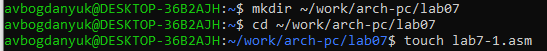{#fig:001 width=70%}

В файл lab7-1.asm ввожу текст листинга(рис. @fig:002).

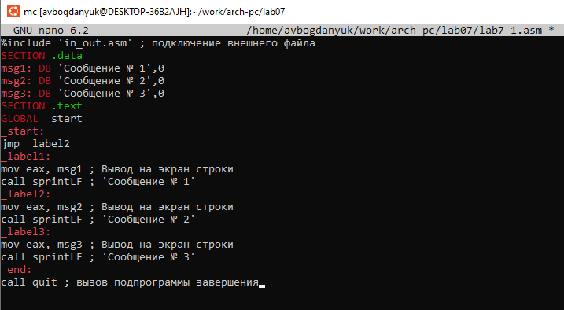{#fig:002 width=70%}

```NASM
%include 'in_out.asm' ; подключение внешнего файла
SECTION .data
msg1: DB 'Сообщение № 1',0
msg2: DB 'Сообщение № 2',0
msg3: DB 'Сообщение № 3',0
SECTION .text
GLOBAL _start
_start:
jmp _label2
_label1:
mov eax, msg1 ; Вывод на экран строки
call sprintLF ; 'Сообщение № 1'
_label2:
mov eax, msg2 ; Вывод на экран строки
call sprintLF ; 'Сообщение № 2'
_label3:
mov eax, msg3 ; Вывод на экран строки
call sprintLF ; 'Сообщение № 3'
_end:
call quit ; вызов подпрограммы завершения
```

Создаю исполнительный файл и запускаю его (рис. @fig:003).

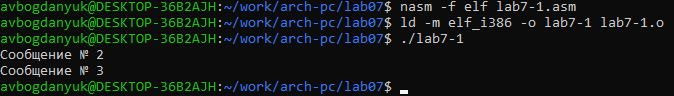{#fig:003 width=70%}

Изменяю текст файла lab7-1.asm (рис. @fig:004).

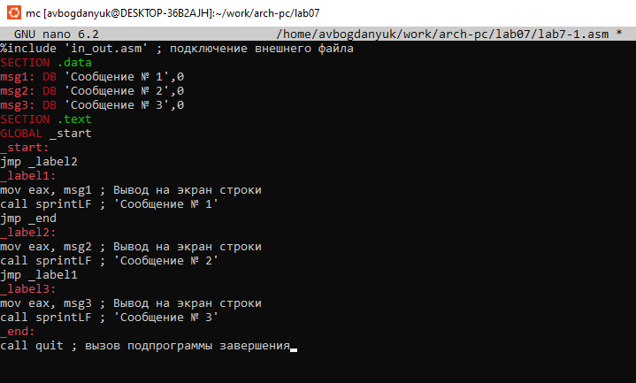{#fig:004 width=70%}

```NASM
%include 'in_out.asm' ; подключение внешнего файла
SECTION .data
msg1: DB 'Сообщение № 1',0
msg2: DB 'Сообщение № 2',0
msg3: DB 'Сообщение № 3',0
SECTION .text
GLOBAL _start
_start:
jmp _label2
_label1:
mov eax, msg1 ; Вывод на экран строки
call sprintLF ; 'Сообщение № 1'
jmp _end
_label2:
mov eax, msg2 ; Вывод на экран строки
call sprintLF ; 'Сообщение № 2'
jmp _label1
_label3:
mov eax, msg3 ; Вывод на экран строки
call sprintLF ; 'Сообщение № 3'
_end:
call quit ; вызов подпрограммы завершения
```

Изменяю текст файла так, чтобы выводилось 3 сообщения (рис. @fig:005).

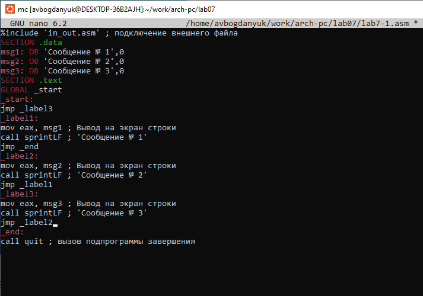{#fig:005 width=70%}

```NASM
%include 'in_out.asm' ; подключение внешнего файла
SECTION .data
msg1: DB 'Сообщение № 1',0
msg2: DB 'Сообщение № 2',0
msg3: DB 'Сообщение № 3',0
SECTION .text
GLOBAL _start
_start:
jmp _label3
_label1:
mov eax, msg1 ; Вывод на экран строки
call sprintLF ; 'Сообщение № 1'
jmp _end
_label2:
mov eax, msg2 ; Вывод на экран строки
call sprintLF ; 'Сообщение № 2'
jmp _label1
_label3:
mov eax, msg3 ; Вывод на экран строки
call sprintLF ; 'Сообщение № 3'
jmp _label2
_end:
call quit ; вызов подпрограммы завершения
```

Создаю исполнительный файл и запускаю его (рис. @fig:006).

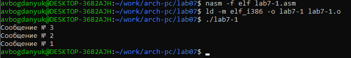{#fig:006 width=70%}


Создаю файл lab7-2.asm и ввожу текст листинга (рис. @fig:007).

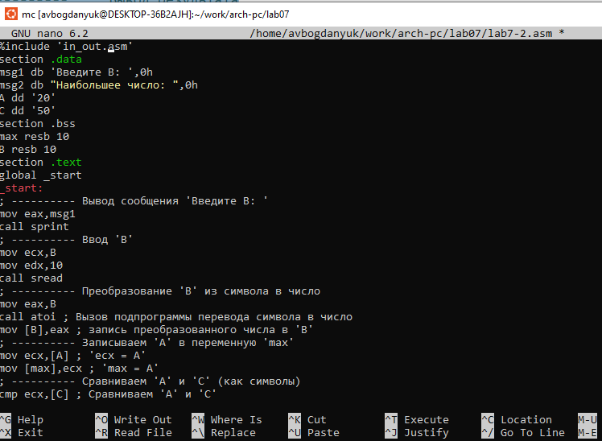{#fig:007 width=70%}

```NASM
%include 'in_out.asm'
section .data
msg1 db 'Введите B: ',0h
msg2 db "Наибольшее число: ",0h
A dd '20'
C dd '50'
section .bss
max resb 10
B resb 10
section .text
global _start
_start:
; ---------- Вывод сообщения 'Введите B: '
mov eax,msg1
call sprint
; ---------- Ввод 'B'
mov ecx,B
mov edx,10
call sread
; ---------- Преобразование 'B' из символа в число
mov eax,B
call atoi ; Вызов подпрограммы перевода символа в число
mov [B],eax ; запись преобразованного числа в 'B'
; ---------- Записываем 'A' в переменную 'max'
mov ecx,[A] ; 'ecx = A'
mov [max],ecx ; 'max = A'
; ---------- Сравниваем 'A' и 'С' (как символы)
cmp ecx,[C] ; Сравниваем 'A' и 'С'
jg check_B ; если 'A>C', то переход на метку 'check_B',
mov ecx,[C] ; иначе 'ecx = C'
mov [max],ecx ; 'max = C'
; ---------- Преобразование 'max(A,C)' из символа в число
check_B:
mov eax,max
call atoi ; Вызов подпрограммы перевода символа в число
mov [max],eax ; запись преобразованного числа в `max`
; ---------- Сравниваем 'max(A,C)' и 'B' (как числа)
mov ecx,[max]
cmp ecx,[B] ; Сравниваем 'max(A,C)' и 'B'
jg fin ; если 'max(A,C)>B', то переход на 'fin',
mov ecx,[B] ; иначе 'ecx = B'
mov [max],ecx
; ---------- Вывод результата
fin:
mov eax, msg2
call sprint ; Вывод сообщения 'Наибольшее число: '
mov eax,[max]
call iprintLF ; Вывод 'max(A,B,C)'
call quit ; Выход
```

Создаю исполнительный файл и запускаю его. Все работает корректно (рис. @fig:008).

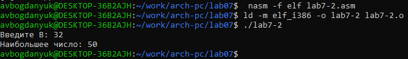{#fig:008 width=70%}

Создаю файл листинга для программы из файла lab7-2.asm (рис. @fig:009).

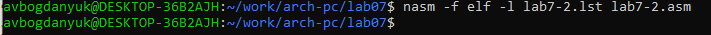{#fig:009 width=70%}

Открываю листинг(рис. @fig:010).

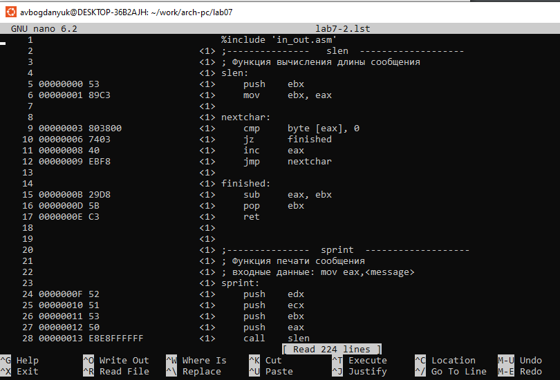{#fig:010 width=70%}

'21' - это номер строки, 'Функция печати сообщения' - комментарий к коду, нет адреса и машинного кода
'22' - это номер строки, 'входные данные: mov eax, <message>' - это комментарий коду, также не имеет адреса и машинного кода
'23' - это номер строки, 'sptint' - название функции, не имеет адрема и машинного кода (рис. @fig:011).

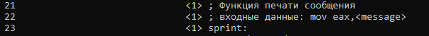{#fig:011 width=70%}

Выбираю инструкцию с двумя операндами, удаляю ту, которая выделена (рис. @fig:012).

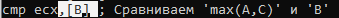{#fig:012 width=70%}

Пытаюсь создать файл листинг, но выдается ошибка, так как иструкция cmp не может работать, имея только один операнд (рис. @fig:013).

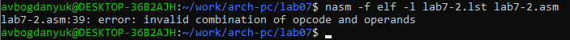{#fig:013 width=70%}

2. Задания для самостоятельной работы

Мой вариант из лабораторной работы №6 - 4. Мои значения а=8, b=88, c=68 (рис. @fig:014).

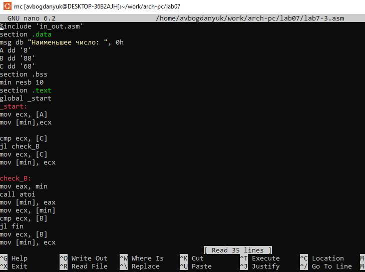{#fig:014 width=70%}

Создаю исполнительный файл и запускаю его. Результат корректный (рис. @fig:015).

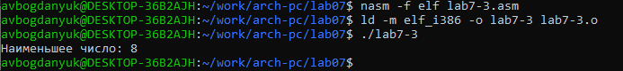{#fig:015 width=70%}

```NASM
%include 'in_out.asm'
section .data
msg db "Наименьшее число: ", 0h
A dd '8'
B dd '88'
C dd '68'
section .bss
min resb 10
section .text
global _start
_start:
mov ecx, [A]
mov [min],ecx

cmp ecx, [C]
jl check_B
mov ecx, [C]
mov [min], ecx

check_B:
mov eax, min
call atoi
mov [min], eax
mov ecx, [min]
cmp ecx, [B]
jl fin
mov ecx, [B]
mov [min], ecx

fin:
mov eax, msg
call sprint
mov eax, [min]
call iprintLF
call quit
```

Вариант 4. 2x+1, если a=0, в противном случае 2x+a (рис. @fig:016).

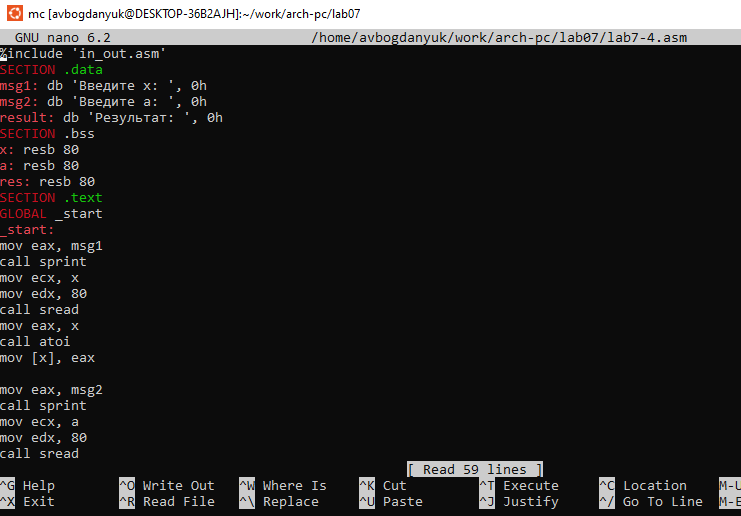{#fig:016 width=70%}

Создание исполнительного файла и запуск его. Результат корректный (рис. @fig:017).

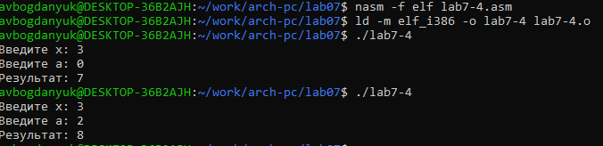{#fig:017 width=70%}

```NASM
%include 'in_out.asm'
SECTION .data
msg1: db 'Введите x: ', 0h
msg2: db 'Введите a: ', 0h
result: db 'Результат: ', 0h
SECTION .bss
x: resb 80
a: resb 80
res: resb 80
SECTION .text
GLOBAL _start
_start:
mov eax, msg1
call sprint
mov ecx, x
mov edx, 80
call sread
mov eax, x
call atoi
mov [x], eax

mov eax, msg2
call sprint
mov ecx, a
mov edx, 80
call sread
mov eax, a
call atoi
mov [a], eax

mov ecx, [a]

cmp ecx, 0
je _f1
jne _f2

_f1:
mov eax, [x]
mov ebx, 2
imul eax, ebx
mov ebx, 1
add eax, ebx
mov [res], eax
jmp _fin

_f2:
mov eax, [x]
mov ebx, 2
imul eax, ebx
add eax, ecx
mov [res], eax
jmp _fin

_fin:
mov eax, result
call sprint
mov eax, [res]
call iprintLF
call quit
```

# Выводы

В ходе проведения лабораторной работы были изучены команды условного и безусловного переходов, приобретены навыки написания программ с использованием переходов. Познакомилась с назначением и структурой файла листинга.


# Список литературы{.unnumbered}

::: {#refs}
:::
