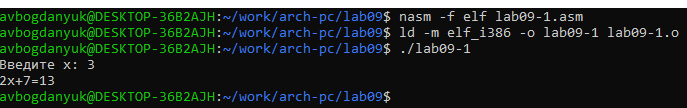
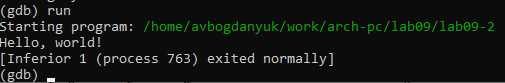
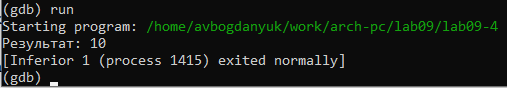

---
## Front matter
title: "Лабораторная работа №9"
subtitle: ". Понятие подпрограммы. Отладчик GDB."
author: "Богданюк Анна Васильевна"

## Generic otions
lang: ru-RU
toc-title: "Содержание"

## Bibliography
bibliography: bib/cite.bib
csl: pandoc/csl/gost-r-7-0-5-2008-numeric.csl

## Pdf output format
toc: true # Table of contents
toc-depth: 2
lof: true # List of figures
lot: true # List of tables
fontsize: 12pt
linestretch: 1.5
papersize: a4
documentclass: scrreprt
## I18n polyglossia
polyglossia-lang:
  name: russian
  options:
	- spelling=modern
	- babelshorthands=true
polyglossia-otherlangs:
  name: english
## I18n babel
babel-lang: russian
babel-otherlangs: english
## Fonts
mainfont: PT Serif
romanfont: PT Serif
sansfont: PT Sans
monofont: PT Mono
mainfontoptions: Ligatures=TeX
romanfontoptions: Ligatures=TeX
sansfontoptions: Ligatures=TeX,Scale=MatchLowercase
monofontoptions: Scale=MatchLowercase,Scale=0.9
## Biblatex
biblatex: true
biblio-style: "gost-numeric"
biblatexoptions:
  - parentracker=true
  - backend=biber
  - hyperref=auto
  - language=auto
  - autolang=other*
  - citestyle=gost-numeric
## Pandoc-crossref LaTeX customization
figureTitle: "Рис."
tableTitle: "Таблица"
listingTitle: "Листинг"
lofTitle: "Список иллюстраций"
lotTitle: "Список таблиц"
lolTitle: "Листинги"
## Misc options
indent: true
header-includes:
  - \usepackage{indentfirst}
  - \usepackage{float} # keep figures where there are in the text
  - \floatplacement{figure}{H} # keep figures where there are in the text
---

# Цель работы

Приобретение навыков написания программ с использованием подпрограмм. Знакомство
с методами отладки при помощи GDB и его основными возможностями.

# Задание

1. Выполнение лабораторной работы
2. Задания для самостоятельной работы

# Теоретическое введение

Отладка — это процесс поиска и исправления ошибок в программе. В общем случае его
можно разделить на четыре этапа:
• обнаружение ошибки;
• поиск её местонахождения;
• определение причины ошибки;
• исправление ошибки.

Можно выделить следующие типы ошибок:
• синтаксические ошибки — обнаруживаются во время трансляции исходного кода и
вызваны нарушением ожидаемой формы или структуры языка;
• семантические ошибки — являются логическими и приводят к тому, что программа
запускается, отрабатывает, но не даёт желаемого результата;
• ошибки в процессе выполнения — не обнаруживаются при трансляции и вызывают прерывание выполнения программы (например, это ошибки, связанные с переполнением
или делением на ноль).

Второй этап — поиск местонахождения ошибки. Некоторые ошибки обнаружить довольно трудно. Лучший способ найти место в программе, где находится ошибка, это разбить
программу на части и произвести их отладку отдельно друг от друга.
Третий этап — выяснение причины ошибки. После определения местонахождения ошибки
обычно проще определить причину неправильной работы программы.
Последний этап — исправление ошибки. После этого при повторном запуске программы,
может обнаружиться следующая ошибка, и процесс отладки начнётся заново.

Наиболее часто применяют следующие методы отладки:
• создание точек контроля значений на входе и выходе участка программы (например,
вывод промежуточных значений на экран — так называемые диагностические сообщения);
• использование специальных программ-отладчиков.
Отладчики позволяют управлять ходом выполнения программы, контролировать и изменять данные. Это помогает быстрее найти место ошибки в программе и ускорить её
исправление. Наиболее популярные способы работы с отладчиком — это использование
точек останова и выполнение программы по шагам.
Пошаговое выполнение — это выполнение программы с остановкой после каждой строчки,
чтобы программист мог проверить значения переменных и выполнить другие действия.
Точки останова — это специально отмеченные места в программе, в которых программаотладчик приостанавливает выполнение программы и ждёт команд. Наиболее популярные
виды точек останова:
• Breakpoint — точка останова (остановка происходит, когда выполнение доходит до
определённой строки, адреса или процедуры, отмеченной программистом);
• Watchpoint — точка просмотра (выполнение программы приостанавливается, если
программа обратилась к определённой переменной: либо считала её значение, либо
изменила его).
Точки останова устанавливаются в отладчике на время сеанса работы с кодом программы, т.е. они сохраняются до выхода из программы-отладчика или до смены отлаживаемой
программы.

GDB (GNU Debugger — отладчик проекта GNU) [1] работает на многих UNIX-подобных
системах и умеет производить отладку многих языков программирования. GDB предлагает
обширные средства для слежения и контроля за выполнением компьютерных программ. Отладчик не содержит собственного графического пользовательского интерфейса и использует
стандартный текстовый интерфейс консоли. Однако для GDB существует несколько сторонних графических надстроек, а кроме того, некоторые интегрированные среды разработки
используют его в качестве базовой подсистемы отладки.
Отладчик GDB (как и любой другой отладчик) позволяет увидеть, что происходит «внутри»
программы в момент её выполнения или что делает программа в момент сбоя.

# Выполнение лабораторной работы

1. Выполнение лабораторной работы

Создаю каталог для выполнения лабораторной работы № 9, перейдаю в него и создаю файл lab09-1.asm (рис. @fig:001).

{#fig:001 width=70%}

Ввожу текст программы из листинга в файл lab09-1.asm (рис. @fig:002).

{#fig:002 width=70%}

Листинг:
```NASM
%include 'in_out.asm'
SECTION .data
msg: DB 'Введите x: ',0
result: DB '2x+7=',0
SECTION .bss
x: RESB 80
res: RESB 80
SECTION .text
GLOBAL _start
_start:
;------------------------------------------
; Основная программа
;------------------------------------------
mov eax, msg
call sprint
mov ecx, x
mov edx, 80
call sread
mov eax,x
call atoi
call _calcul ; Вызов подпрограммы _calcul
mov eax,result
call sprint
mov eax,[res]
call iprintLF
call quit
;------------------------------------------
; Подпрограмма вычисления
; выражения "2x+7"
_calcul:
mov ebx,2
mul ebx
add eax,7
mov [res],eax
ret ; выход из подпрограммы
```
Создаю исполнительный файл и запускаю его. Программа работает корректно (рис. @fig:003).

{#fig:003 width=70%}

Изменяю текст программы так, чтобы сначала считалась 3х-1, затем результ этого уравнение был х в уравнении 2х+7. В первом уравнении х=3, выражение равно 8, значит f(x)=16+7=23. Создаю исполнительный файл и запускаю его. Программа работает корректно (рис. @fig:004).

{#fig:004 width=70%}

Листинг:
```NASM
%include 'in_out.asm'
SECTION .data
msg: DB 'Введите x: ',0
result: DB '2x+7=',0
SECTION .bss
x: RESB 80
res: RESB 80
SECTION .text
GLOBAL _start
_start:
;------------------------------------------
; Основная программа
;------------------------------------------
mov eax, msg
call sprint
mov ecx, x
mov edx, 80
call sread
mov eax,x
call atoi

call _calcul ; Вызов подпрограммы _calcul
mov eax,result
call sprint
mov eax,[res]
call iprintLF
call quit
;------------------------------------------
; Подпрограмма вычисления
; выражения "2x+7"
_calcul:
call _subcalcul
mov ebx,2
mul ebx
add eax,7
mov [res],eax
ret

_subcalcul:
mov ebx, 3
mul ebx
add eax, -1
mov [res], eax
ret
```

Создаю файл lab09-2 и ввожу текст программы из листинга (рис. @fig:005).

{#fig:005 width=70%}

Листинг:
```NASM
SECTION .data
msg1: db "Hello, ",0x0
msg1Len: equ $ - msg1
msg2: db "world!",0xa
msg2Len: equ $ - msg2
SECTION .text
global _start
_start:
mov eax, 4
mov ebx, 1
mov ecx, msg1
mov edx, msg1Len
int 0x80
mov eax, 4
mov ebx, 1
mov ecx, msg2
mov edx, msg2Len
int 0x80
mov eax, 1
mov ebx, 0
int 0x80
```

Получаю исполняемый файл.Для работы с GDB в исполняемый файл необходимо добавить отладочную информацию, для этого трансляцию программ необходимо проводить с ключом ‘-g’ (рис. @fig:006).

{#fig:006 width=70%}

Загружаю исполняемый файл в отладчик gdb (рис. @fig:007).

{#fig:007 width=70%}

Проверяю работу программы, запустив ее в оболочке GDB с помощью команды run (рис. @fig:008).

{#fig:008 width=70%}

Для более подробного анализа программы установливаю брейкпоинт на метку _start, с которой начинается выполнение любой ассемблерной программы, и запускаю её (рис. @fig:009).

{#fig:009 width=70%}

Смотрю дисассимилированный код программы с помощью команды disassemble начиная с метки _start (рис. @fig:010).

{#fig:010 width=70%}

Переключаю на отображение команд с Intel’овским синтаксисом, введя команду set disassembly-flavor intel. Существует два режима отображения синтаксиса машинных команд: режим Intel, используемый в том числе в NASM, и режим ATT (значительно отличающийся внешне). По
умолчанию в дизассемблере GDB принят режим ATT. Переключиться на отображение команд
с привычным Intel’овским синтаксисом можно, введя команду set disassembly-flavor
intel (рис. @fig:011).

{#fig:011 width=70%}

Включаю режим псевдографики для более удобного анализа программы (рис. @fig:012).

{#fig:012 width=70%}

На предыдущих шагах была установлена точка останова по имени метки (_start). Проверяю это с помощью команды info breakpoints (рис. @fig:013).

{#fig:013 width=70%}

Установим еще одну точку останова по адресу инструкции. Определяю адрес предпоследней инструкции (mov ebx,0x0) и установливаю точку останова (рис. @fig:014).

{#fig:014 width=70%}

Смотрю информацию о всех установаленных точках останова (рис. @fig:015).

{#fig:015 width=70%}

Смотрю содержимое регистров с помощью команды info registers (рис. @fig:016).

{#fig:016 width=70%}

Смотрю значение переменной msg1 по имени. Значение переменной msg2 на рис.19 (рис. @fig:017).

{#fig:017 width=70%}

Изменяю первый символ переменной msg1 (рис. @fig:018).

{#fig:018 width=70%}

Вывожу содержимое переменной msg2. Изменяю первый символ на 'v' (рис. @fig:019).

{#fig:019 width=70%}

С помощью команды set изменяю значение регистра ebx (рис. @fig:020).

{#fig:020 width=70%}

С помощью команды set изменяю значение регистра ebx  (рис. @fig:021).

{#fig:021 width=70%}

Завершаю выполнение программы с помощью команды continue (рис. @fig:022).

{#fig:022 width=70%}

Выхожу из GDB с помощью команды quit (рис. @fig:023).

{#fig:023 width=70%}

Копируйте файл lab8-2.asm, созданный при выполнении лабораторной работы №8, с программой выводящей на экран аргументы командной строки (Листинг 8.2) в файл с именем lab09-3.asm (рис. @fig:024).

{#fig:024 width=70%}

Создаю исполняемый файл (рис. @fig:025).

{#fig:025 width=70%}

Для загрузки в gdb программы с аргументами необходимо использовать ключ --args. Загружаю исполняемый файл в отладчик, указав аргументы (рис. @fig:026).

{#fig:026 width=70%}

Для начала установливаю точку останова перед первой инструкцией в программе и запускаю ее. (рис. @fig:027).

{#fig:027 width=70%}

Адрес вершины стека храниться в регистре esp и по этому адресу располагается число равное количеству аргументов командной строки (включая имя программы) (рис. @fig:028).

{#fig:028 width=70%}

Смотрю остальные позиции стека – по адесу [esp+4] располагается адрес в памяти где находиться имя программы, по адесу [esp+8] храниться адрес первого аргумента, по аресу [esp+12] – второго и т.д. (рис. @fig:029).

{#fig:029 width=70%}

2. Задания для самостоятельной работы

Создаю файл lab09-4.asm и ввожу в него текст программы листинга  (рис. @fig:030).

{#fig:030 width=70%}

Создаю исполнительный файл и запускаю его. Действительно, программа работает неверно (рис. @fig:039).

{#fig:039 width=70%}

Создаю исполнительный файл для работы с GDB (рис. @fig:031).

{#fig:031 width=70%}

Загружаю исполнительный файл в отладчик gdb (рис. @fig:032).

{#fig:032 width=70%}

Проверяю работу программы, запустив ее в оболочке GDB с помощью команды run (рис. @fig:033).

{#fig:033 width=70%}

Для более подробного анализа программы установливаю брейкпоинт на метку _start, с которой начинается выполнение любой ассемблерной программы, и запускаю её. (рис. @fig:034).

{#fig:034 width=70%}

Смотрю дисассимилированный код программы с помощью команды disassemble начиная с метки _start (рис. @fig:035).

{#fig:035 width=70%}

Переключаюсь на отображение команд с Intel’овским синтаксисом, введя команду set disassembly-flavor intel(рис. @fig:036).

{#fig:036 width=70%}

На предыдущих шагах была установлена точка останова по имени метки (_start). Проверяю это с помощью команды info breakpoints (рис. @fig:037).

{#fig:037 width=70%}

С помощью stepi буду отслеживать, как изменяются значения регистров (рис. @fig:038).

{#fig:038 width=70%}

На 3 шаге значение ebx = 5 (рис. @fig:040).

{#fig:040 width=70%}

На шаге 5 произошла ошибка. ecx было умножено не на ebx, а на eax. Значение ebx а этом шаге должно было быть равно 20, но оно равно 2*4=8 (рис. @fig:041).

{#fig:041 width=70%}

На этом шаге виден результат вычисления программы. ebx = ebx + 5, но, так как ebx = 5 = 3+2, а не ebx=20+5, конечный результат равен не 25, а 10 (рис. @fig:042).

{#fig:042 width=70%}

Изменяю текст программы так, чтобы вычисления были верными (рис. @fig:043).

{#fig:043 width=70%}

Создаю исполнительный файл и запускаю его. Программа работает корректно (рис. @fig:044).

{#fig:044 width=70%}

Листинг:
```NASM                                 
%include 'in_out.asm'
SECTION .data
div: DB 'Результат: ',0
SECTION .text
GLOBAL _start
_start:
; ---- Вычисление выражения (3+2)*4+5
mov eax,3
mov ebx,2
add eax,ebx
mov ecx,4
mul ecx
add eax,5
mov edi,eax
; ---- Вывод результата на экран
mov eax,div
call sprint
mov eax,edi
call iprintLF
call quit
```

# Выводы

В ходе выполнения лабораторной работы были приобретены навыки написания программ с использованием подпрограмм. Я ознакомилась с методами отладки при помощи GDB и его основными возможностями.

# Список литературы{.unnumbered}

::: {#refs}
:::
