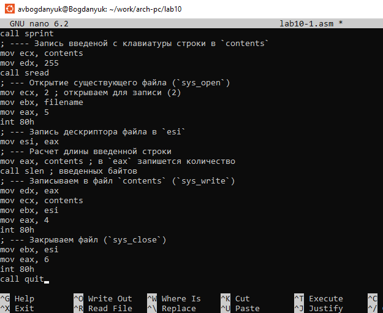

---
## Front matter
title: "Лабораторная работа №10"
subtitle: "Работа с файлами средствами Nasm"
author: "Богданюк Анна Васильевна"

## Generic otions
lang: ru-RU
toc-title: "Содержание"

## Bibliography
bibliography: bib/cite.bib
csl: pandoc/csl/gost-r-7-0-5-2008-numeric.csl

## Pdf output format
toc: true # Table of contents
toc-depth: 2
lof: true # List of figures
lot: true # List of tables
fontsize: 12pt
linestretch: 1.5
papersize: a4
documentclass: scrreprt
## I18n polyglossia
polyglossia-lang:
  name: russian
  options:
	- spelling=modern
	- babelshorthands=true
polyglossia-otherlangs:
  name: english
## I18n babel
babel-lang: russian
babel-otherlangs: english
## Fonts
mainfont: PT Serif
romanfont: PT Serif
sansfont: PT Sans
monofont: PT Mono
mainfontoptions: Ligatures=TeX
romanfontoptions: Ligatures=TeX
sansfontoptions: Ligatures=TeX,Scale=MatchLowercase
monofontoptions: Scale=MatchLowercase,Scale=0.9
## Biblatex
biblatex: true
biblio-style: "gost-numeric"
biblatexoptions:
  - parentracker=true
  - backend=biber
  - hyperref=auto
  - language=auto
  - autolang=other*
  - citestyle=gost-numeric
## Pandoc-crossref LaTeX customization
figureTitle: "Рис."
tableTitle: "Таблица"
listingTitle: "Листинг"
lofTitle: "Список иллюстраций"
lotTitle: "Список таблиц"
lolTitle: "Листинги"
## Misc options
indent: true
header-includes:
  - \usepackage{indentfirst}
  - \usepackage{float} # keep figures where there are in the text
  - \floatplacement{figure}{H} # keep figures where there are in the text
---

# Цель работы

Приобретение навыков написания программ для работы с файлами.

# Задание

1. Выполнение лабораторной работы
2. Задания для самостоятельной работы

# Теоретическое введение

ОС GNU/Linux является многопользовательской операционной системой. И для обеспечения защиты данных одного пользователя от действий других пользователей существуют
специальные механизмы разграничения доступа к файлам. Кроме ограничения доступа, данный механизм позволяет разрешить другим пользователям доступ данным для совместной
работы.
Права доступа определяют набор действий (чтение, запись, выполнение), разрешённых
для выполнения пользователям системы над файлами. Для каждого файла пользователь
может входить в одну из трех групп: владелец, член группы владельца, все остальные. Для
каждой из этих групп может быть установлен свой набор прав доступа. Владельцем файла
является его создатель. Для предоставления прав доступа другому пользователю или другой
группе командой
chown [ключи] <новый_пользователь>[:новая_группа] <файл>
или
chgrp [ключи] < новая_группа > <файл>

Общий алгоритм работы с системными вызовами в Nasm можно представить в следующем
виде:
1. Поместить номер системного вызова в регистр EAX;
2. Поместить аргументы системного вызова в регистрах EBX, ECX и EDX;
3. Вызов прерывания (int 80h);
4. Результат обычно возвращается в регистр EAX.

Для создания и открытия файла служит системный вызов sys_creat, который использует
следующие аргументы: права доступа к файлу в регистре ECX, имя файла в EBX и номер
системного вызова sys_creat (8) в EAX

Для записи в файл служит системный вызов sys_write, который использует следующие
аргументы: количество байтов для записи в регистре EDX, строку содержимого для записи
ECX, файловый дескриптор в EBX и номер системного вызова sys_write (4) в EAX.
Системный вызов возвращает фактическое количество записанных байтов в регистр EAX.
В случае ошибки, код ошибки также будет находиться в регистре EAX.
Прежде чем записывать в файл, его необходимо создать или открыть, что позволит получить дескриптор файла.

Для чтения данных из файла служит системный вызов sys_read, который использует
следующие аргументы: количество байтов для чтения в регистре EDX, адрес в памяти для
записи прочитанных данных в ECX, файловый дескриптор в EBX и номер системного вызова
sys_read (3) в EAX. Как и для записи, прежде чем читать из файла, его необходимо открыть,
что позволит получить дескриптор файла.

Для правильного закрытия файла служит системный вызов sys_close, который использует
один аргумент – дескриптор файла в регистре EBX. После вызова ядра происходит удаление
дескриптора файла, а в случае ошибки, системный вызов возвращает код ошибки в регистр
EAX.

Для изменения содержимого файла служит системный вызов sys_lseek, который использует следующие аргументы: исходная позиция для смещения EDX, значение смещения в
байтах в ECX, файловый дескриптор в EBX и номер системного вызова sys_lseek (19) в EAX.

Удаление файла осуществляется системным вызовом sys_unlink, который использует
один аргумент – имя файла в регистре EBX.

# Выполнение лабораторной работы

1. Выполнение лабораторной работы

Создаю каталог lab10 для программ лабораторной работы №10, перехожу в него и создаю файлы lab10-1.asm, readme-1.txt и readme-2.txt (рис. @fig:001).

{#fig:001 width=70%}

Ввожу в файл lab10-1.asm текст программы из листинга (рис. @fig:002).

{#fig:002 width=70%}

Листинг:
```NASM
%include 'in_out.asm'
SECTION .data
filename db 'readme.txt', 0h ; Имя файла
msg db 'Введите строку для записи в файл: ', 0h ; Сообщение
SECTION .bss
contents resb 255 ; переменная для вводимой строки
SECTION .text
global _start
_start:
; --- Печать сообщения `msg`
mov eax,msg
call sprint
; ---- Запись введеной с клавиатуры строки в `contents`
mov ecx, contents
mov edx, 255
call sread
; --- Открытие существующего файла (`sys_open`)
mov ecx, 2 ; открываем для записи (2)
mov ebx, filename
mov eax, 5
int 80h
; --- Запись дескриптора файла в `esi`
mov esi, eax
; --- Расчет длины введенной строки
mov eax, contents ; в `eax` запишется количество
call slen ; введенных байтов
; --- Записываем в файл `contents` (`sys_write`)
mov edx, eax
mov ecx, contents
mov ebx, esi
mov eax, 4
int 80h
; --- Закрываем файл (`sys_close`)
mov ebx, esi
mov eax, 6
int 80h
call quit
```

Создаю исполнительный файл и запускаю его. Проверяю с помощью ls и cat. Программа выполняется корректно (рис. @fig:003).

{#fig:003 width=70%}

С помощью команды chmod изменяю права доступа к исполняемому файлу lab10-1 (a-x - для всех пользователей отменить право на исполнение), запретив его исполнение для всех. Пытаюсь выполнить его. Выводится сообщение 'Permission denied', потому что мне, как owner, запрещено исполнять файл (рис. @fig:004).

{#fig:004 width=70%}

С помощью chmod изменяю право доступа к файлу lab10-1.asm с исходным текстом программы, добавив права на исполнение (a+x - для всех пользователей добваить право на исполнение) (рис. @fig:005).

{#fig:005 width=70%}

Пытаюсь выполнить lab10-1.asm. Выводится построчно содержимое файла (рис. @fig:006).

{#fig:006 width=70%}

Мой вариант - 4. Сначала изменяю права доступа к файлу readme-1.txt в символьном виде. Проверяю с помощью ls, все сработало корректно (рис. @fig:007).

{#fig:007 width=70%}

Теперь изменяю права доступа к файлу readme-2.txt  двоичном виде. 001 - 1, 011 - 3, 110 - 6. Проверяю с помощью ls, работает корректно(рис. @fig:008).

{#fig:008 width=70%}

2. Задания для самостоятельной работы

Создаю файл lab10-2.asm, ввожу текст программы, чтобы:вывод приглашения “Как Вас зовут?”, ввести с клавиатуры свои фамилию и имя, создать файл с именем name.txt, записать в файл сообщение “Меня зовут”, дописать в файл строку введенную с клавиатуры, закрыть файл. (рис. @fig:010).

{#fig:010 width=70%}

Листинг:
```NASM
%include 'in_out.asm'

SECTION .data
filename db 'name.txt', 0h
msg db 'Как Вас зовут? ', 0h
msg2 db 'Меня зовут ', 0h

SECTION .bss
contents resb 255

SECTION .text
global _start

_start:
mov eax,msg
call sprint

mov ecx,contents
mov edx,255
call sread

mov ecx,2
mov ebx,filename
mov eax,5
int 80h
mov esi,eax

mov eax,msg2
call slen

mov edx, eax
mov ecx, msg2
mov ebx, esi
mov eax, 4
int 80h

mov eax,contents
call slen

mov edx, eax
mov ecx, contents
mov ebx, esi
mov eax, 4
int 80h

mov ebx, esi
mov eax, 6
int 80h
call quit
```

Создаю исполняемый файл и запускаю его, проверяю с помощью cat. Работает корректно (рис. @fig:009).

{#fig:009 width=70%}

Проверяю с помощью ls (рис. @fig:011).

{#fig:011 width=70%}

# Выводы

В ходе выполнения лабораторной работы были приобретены навыки написания программ для работы с файлами.

# Список литературы{.unnumbered}

::: {#refs}
:::
